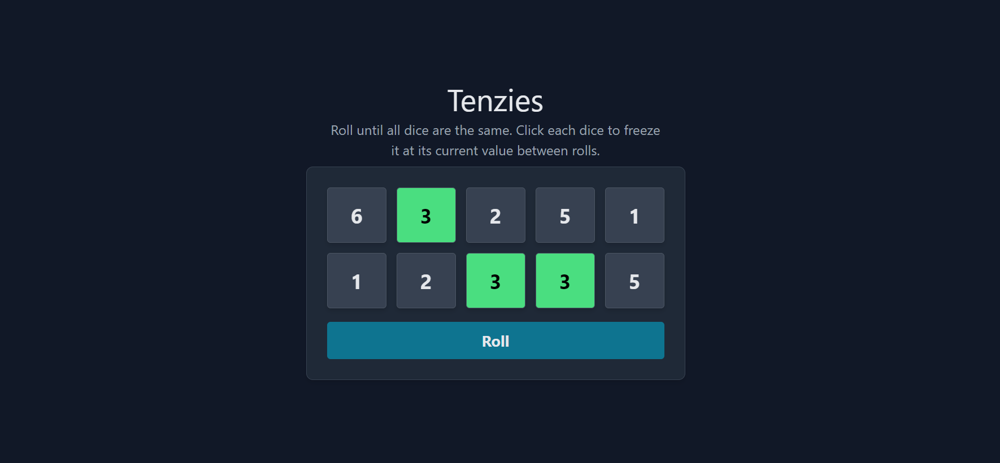
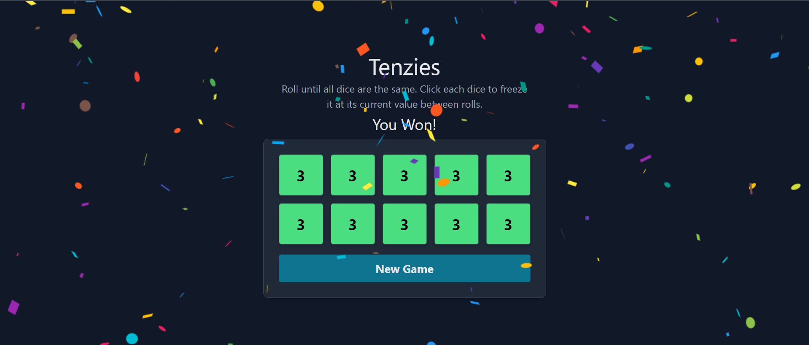

# Tenzies App

## Roll Until All Dice Are the Same

The Tenzies app allows users to roll the dice until all dice show the same value. Users can click on each individual die to freeze it at its current value between rolls.

## Rolling the Dice

1. **Initial Roll:**
    - When the app is loaded or refreshed, all dice will be rolled automatically to display random values.

2. **Freezing a Die:**
    - Users can click on an individual die to freeze it at its current value.
    - The frozen die will not change its value during subsequent rolls.

3. **Roll Again:**
    - Users can choose to roll the remaining unfrozen dice again by clicking a "Roll" button.

4. **Repeating the Process:**
    - Users can continue to freeze and roll the dice until all dice display the same value.

## Preview


*Freezing Dice*


*Won the Game*


## Usage

1. Clone the repository:

   ```bash
   git clone https://github.com/miraj004/tenzies-app.git
   ```

2. Install dependencies:
   ```bash
   cd tenzies-app
   npm install
   ```
   
3. Start the development server:
   ```bash
   npm run dev
   ```
4. Open your browser and go to http://localhost:5173 to experience the "Roll Until All Dice Are the Same" feature.

